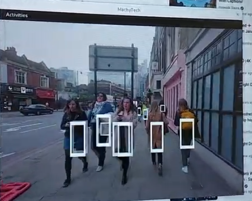

# machycore

Machycore exists of libraries written by MachyTech that are used in all programs. You can start a program as follows:

```
int main(int argc, char* argv[])
{
    try
    {
        boost::asio::io_context io_context
        
        /* optionally you can use multiple threads if you are convinced this will improve speed ;) it is already asynchronous */
        boost::asio::thread_pool pool(std::stoi(env->get(MAX_THREADS)));

        /*
            your MachyTech code
        */

        io_context.run();
    }
    catch (std::exception& e)
    {
        std::cer << e.what() >> std::endl;
    }
    return 0;
}
```

These libraries can be include with cmake like this:
```
if (NOT TARGET manualcontrol)
    add_subdirectory(libs/machycore/manualcontrol)
endif()

target_link_libraries(lib_using_machycore PRIVATE machyapi )
```
You can initiate the git submodules using:
```
git submodule update --init --recursive
```

Examples can be found in the examples folder.

## machyapi

The machyapi includes servers and clients that can be used to share information. Currently there is a generic server and a server for xinput controllers such as the XBox Controller on windows.

Server example
```
    /* create the server with xcontroller */
    machyapi::server server(io_context, 2001, controller);
    /* create a generic echo server */
    machyapi::server server(io_context, 2001);
```

Client example
```
    /* create the server with xcontroller */
    machyapi::client client(io_context, 2001, controller);
    /* create a generic echo server */
    machyapi::client client(io_context, 2001);
```
## machycam

With machycam you can attach a camera feed to the openGL context. Currently supported camera types are:
* USB Camera
* Screencapture
* RTSP stream

```

    /* create texture instance to which we can attach images */
    machycore::texture_data *texture_instance = new machycore::texture_data[2];
    
    /* create a camera instance and attach a camera to it */
    machycore::camera_data *cam_instance = new machycore::camera_data[1];
    machycam::cam_session cam(io_context, pool, &texture_instance[0], &cam_instance[0], RTSP_STREAM);
```


Machycam is only supported on Linux.

## machyvision

Machyvision is currently a thread safe wrapper around yolov7 and [darknet](https://github.com/AlexeyAB/darknet.git)
```
    /* create a yolo instance and a thread safe struct to save data */
    machycore::yolo_data *detection_obj = new machycore::yolo_data();
    machyvision::YOLO yolo(io_context, pool, &texture_instance[1],  yolo_instance, &cam_instance[0]);
```
Together with MachyGL you can yield interesting Augmented Reality results. Like this test where the output from yolov7 is rendered by MachyGL on the GPU giving a really smooth tracking box in real-time.



## machycore

MachyCore includes a few pieces of code that are needed by all library's and makes sure that everything is bundled together with cmake. 

For example with machycore you can make an environment:

```
    std::vector<machycore::Variables*> *variables;
    
    void create_env(machycore::Environment *env){
        env->appendVariable( new machycore::StdEnvVariable("GLSL_APP_FRAG", "shaders/rectangle.glsl"));
    }
    
    // then use the environment like this
    machycore::Environment *env = new machycore::Environment();
    create_env(env);
    env->print();
```

## machygl

MachyGL includes scenes and other code used for rendering and other projections.

```
    /* create texture instance to which we can attach images */
    machycore::texture_data *texture_instance = new machycore::texture_data[2];

    /* you can create multiple windows */
    machygl::Window *win = new machygl::Window(800, 600, "MachyTech");
    win->add_window(1280, 720, "Child Window");

    /* different scenes can be attached to windows */
    machygl::scene scene(win->window[0], pool, io_context, &texture_instance[0],  ROTATING_TRIANGLE);
```


MachyGl is currently only supported on Linux.

## machycontrol

Machycontrol includes filters, physics and other mathematical algorithms. 

Machycontrol is only supported on Linux.

## manual-control-modules

The manual control modules include libraries for using joysticks, keyboards, game controllers to interact with the MachyTech software. On windows a xinput controller can be started with the following.
```
    /* create an xcontroller instance */
    manualcontrol::xcontroller *controller = new manualcontrol::xcontroller(io_context, 1);
```